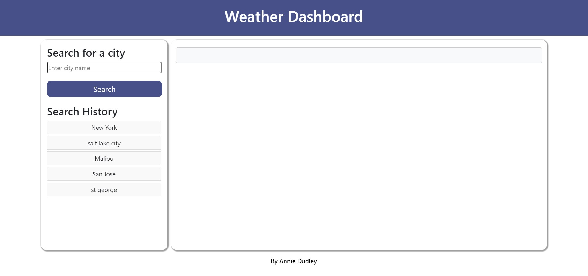
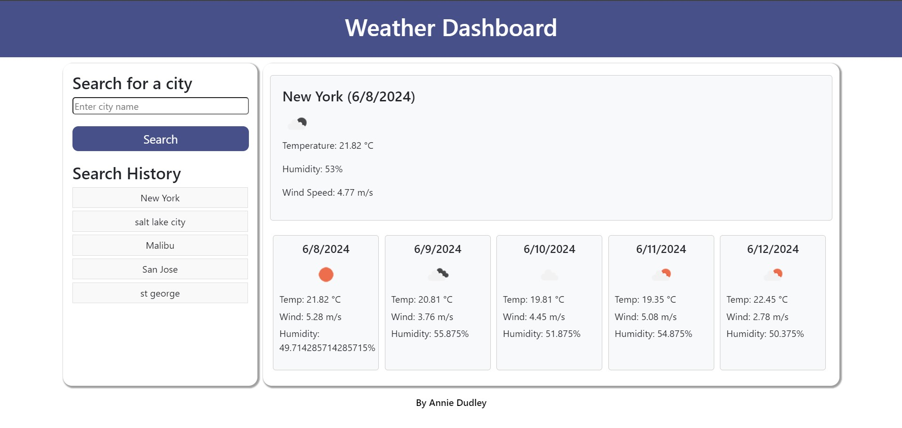

# CityClimateTracker

## Description

This project involves creating a weather dashboard application that allows users to search for current and future weather conditions of any city. The application runs in the browser and features dynamically updated HTML and CSS powered by JavaScript. It utilizes the OpenWeatherMap API to retrieve and display weather data, including a 5-day forecast.

## Challenge
### User Story

AS A user who wants to know the weather outlook for multiple cities,
I WANT a weather dashboard,
SO THAT I can view current weather conditions and a 5-day forecast for any city I search.

### Acceptance Criteria

GIVEN a weather dashboard with form inputs
WHEN I search for a city, THEN I am presented with current and future conditions for that city and that city is added to the search history.
WHEN I view current weather conditions for that city, THEN I am presented with the city name, the date, an icon representation of weather conditions, the temperature, the humidity, and the wind speed.
WHEN I view future weather conditions for that city, THEN I am presented with a 5-day forecast that displays the date, an icon representation of weather conditions, the temperature, the wind speed, and the humidity.
WHEN I click on a city in the search history, THEN I am again presented with current and future conditions for that city.

## Screenshots

## Deployed Application
[Link to Deployed Application](https://anniebooth00.github.io/CityClimateTracker/)

## Usage
This application is ideal for anyone who needs to quickly find the weather conditions for multiple cities, including a detailed 5-day forecast.

## License
This project is licensed under the MIT License.

## Credit
Annie Dudley & Openweathermap.org for API.

## Contact
For questions or feedback, feel free to contact me at anniebooth00@gmail.com.
